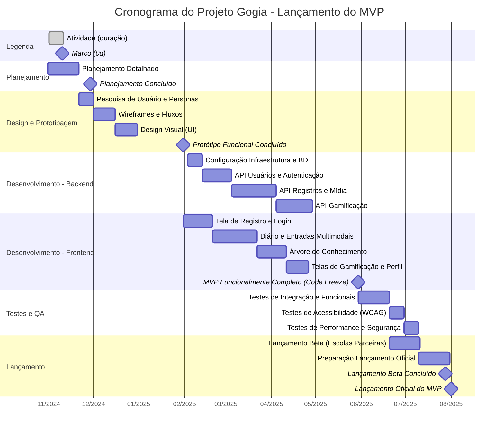

```mermaid
gantt
    title Cronograma do Projeto Gogia - Lançamento do MVP
    dateFormat  YYYY-MM-DD
    axisFormat  %m/%Y

    section Legenda
    Atividade (duração) :done, 2024-11-01, 10d
    Marco (0d) :milestone, 2024-11-10, 0d

    section Planejamento
    Planejamento Detalhado :id_111, 2024-10-31, 21d
    Planejamento Concluído :milestone, id_112, 2024-11-29, 0d

    section Design e Prototipagem
    Pesquisa de Usuário e Personas :id_1211, after id_111, 10d
    Wireframes e Fluxos :id_1212, after id_1211, 15d
    Design Visual (UI) :id_1213, after id_1212, 15d
    Protótipo Funcional Concluído :milestone, id_1214, 2025-01-31, 0d

    section Desenvolvimento - Backend
    Configuração Infraestrutura e BD :id_1221, 2025-02-03, 10d
    API Usuários e Autenticação :id_1222, after id_1221, 20d
    API Registros e Mídia :id_1223, after id_1222, 30d
    API Gamificação :id_1224, after id_1223, 25d

    section Desenvolvimento - Frontend
    Tela de Registro e Login :id_1231, after id_1214, 20d
    Diário e Entradas Multimodais :id_1232, after id_1231, 30d
    Árvore do Conhecimento :id_1233, after id_1232, 20d
    Telas de Gamificação e Perfil :id_1234, after id_1233, 15d
    MVP Funcionalmente Completo (Code Freeze) :milestone, id_124, 2025-05-30, 0d

    section Testes e QA
    Testes de Integração e Funcionais :id_1251, after id_124, 21d
    Testes de Acessibilidade (WCAG) :id_1252, after id_1251, 10d
    Testes de Performance e Segurança :id_1253, after id_1252, 10d

    section Lançamento
    Lançamento Beta (Escolas Parceiras) :id_1261, after id_1251, 21d
    Preparação Lançamento Oficial :id_1263, after id_1253, 21d
    Lançamento Beta Concluído :milestone, id_1262, 2025-07-28, 0d
    Lançamento Oficial do MVP :milestone, id_1264, 2025-08-01, 0d
```
